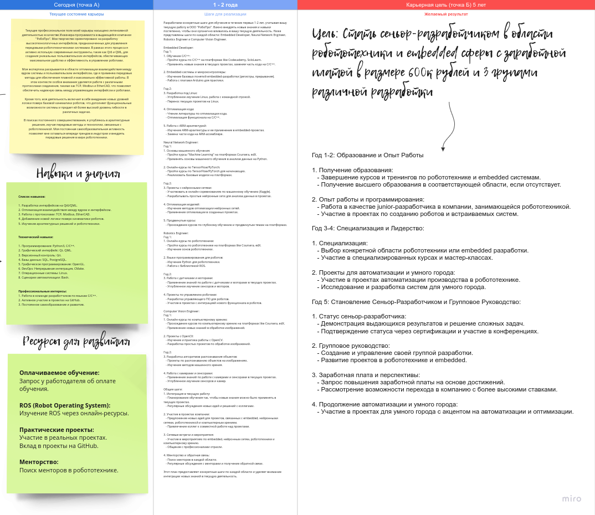
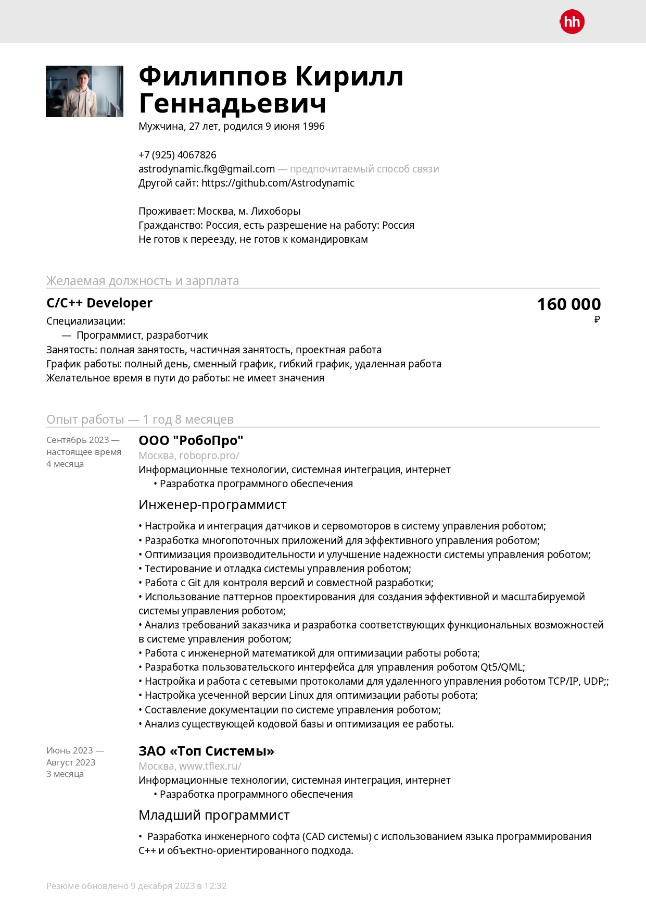
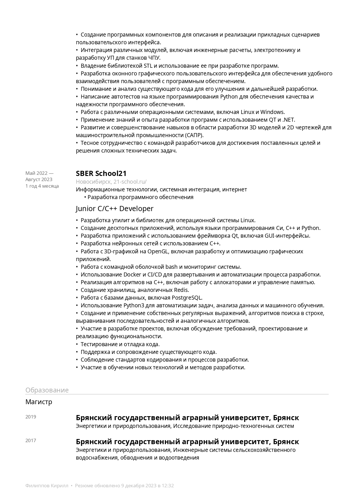
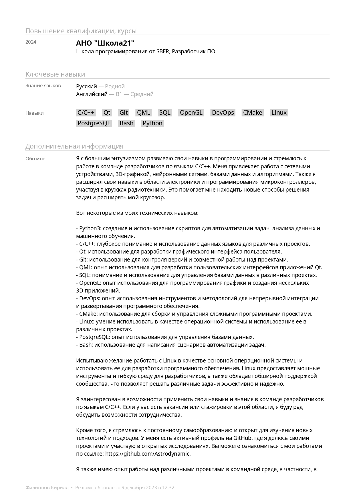
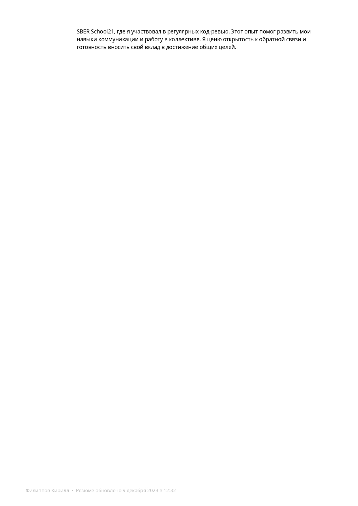

# Стратегия личного развития

- [Стратегия личного развития](#стратегия-личного-развития)
  - [***Колесо Жизненного Баланса***](#колесо-жизненного-баланса)
    - [Почему я исследую Колесо Жизненного Баланса](#почему-я-исследую-колесо-жизненного-баланса)
  - [***Колесо карьерного баланса***](#колесо-карьерного-баланса)
  - [***Карьерные цели***](#карьерные-цели)
  - [***Анализ вакансий***](#анализ-вакансий)
    - [Embedded Developer:](#embedded-developer)
    - [Neural Network Engineer:](#neural-network-engineer)
    - [Robotics Engineer:](#robotics-engineer)
    - [Computer Vision Engineer:](#computer-vision-engineer)
    - [Обучение:](#обучение)
  - [***Карьерные цели(дополнено)***](#карьерные-целидополнено)
  - [***Анализ навыков***](#анализ-навыков)
  - [***Резюме***](#резюме)
  - [***Проверка резюме и общие рекомендации к оформлению***](#проверка-резюме-и-общие-рекомендации-к-оформлению)
  - [***Сопроводительное письмо***](#сопроводительное-письмо)
    - [Зачем я нужен вашей компании?](#зачем-я-нужен-вашей-компании)
    - [Зачем компания нужна мне?](#зачем-компания-нужна-мне)
  - [***Примеры ответов на вопросы от HR***](#примеры-ответов-на-вопросы-от-hr)
  - [***Примеры ответов на вопросы к HR***](#примеры-ответов-на-вопросы-к-hr)
  - [***Пример разказа о себе***](#пример-разказа-о-себе)
  - [***Пример вопросов о корпоративной культуре компании***](#пример-вопросов-о-корпоративной-культуре-компании)
  - [***Пример приветствия от нового члена команды***](#пример-приветствия-от-нового-члена-команды)
  - [***Пример взаимодействия с руководителем по задачам***](#пример-взаимодействия-с-руководителем-по-задачам)
  - [***Пример получения обратной связи***](#пример-получения-обратной-связи)
  - [***Выстраивание отношений с коллегами:***](#выстраивание-отношений-с-коллегами)

## ***Колесо Жизненного Баланса***

Колесо Жизненного Баланса представляет собой графическое изображение, разделенное на различные сектора, каждый из которых представляет собой определенную сферу вашей жизни. Эти сферы могут включать в себя работу, здоровье, отношения, личное развитие и другие аспекты вашей жизни. Идея заключается в том, чтобы визуализировать, насколько уравновешена ваша жизнь в этих различных областях.

Часто, если одна из сфер сильно выделяется или, наоборот, недостаточно развита, это может привести к дисбалансу и, как следствие, к ухудшению общего качества жизни. Колесо Жизненного Баланса помогает вам осознать, в какой сфере вам нужно уделить больше внимания, чтобы достичь гармонии и уравновешенности.

### Почему я исследую Колесо Жизненного Баланса

1. **Осознание приоритетов:** Колесо Жизненного Баланса помогает мне ясно определить, какие аспекты моей жизни требуют большего внимания и усилий. Это позволяет мне лучше понимать свои приоритеты и направлять усилия в те области, которые наиболее важны для моего благополучия.

2. **Управление временем:** Анализ баланса жизни помогает мне эффективнее распределять свое время между различными сферами. Это особенно полезно для избежания перегрузки в одной области жизни за счет ущерба другим.

3. **Стремление к гармонии:** Исследование Колеса Жизненного Баланса направлено на достижение гармонии в моей жизни. Уравновешенность между различными аспектами создает благоприятные условия для общего благосостояния и успеха.

4. **Личное развитие:** Постоянное наблюдение за балансом жизни способствует моему личному росту и развитию. Это стимулирует меня стремиться к постоянному улучшению в различных областях жизни.

Итак, исследование Колеса Жизненного Баланса стало важным элементом моей стратегии личного развития, помогая мне лучше понимать, куда направить свои усилия, чтобы достичь гармонии и удовлетворения в различных сферах моей жизни.

 

## ***Колесо карьерного баланса***

## ***Карьерные цели***

## ***Анализ вакансий***

Анализ вакансий показал полное отсуствие необходимых навыков для развития в области автоматизации и робототехники. Ниже представлены обязанности и требования к кандидату, которые в большинстве своём отсуствуют у меня.

### Embedded Developer:
1. **Опыт работы с embedded системами:**
   - Проекты на микроконтроллерах (Arduino, Raspberry Pi).
   - Изучение документации и примеров по работе с embedded системами.

2. **Знание языков C/C++:**
   - Углубленное изучение C/C++.
   - Работа с микроконтроллерами на C/C++.

3. **Разработка драйверов и встроенных систем:**
   - Изучение создания драйверов под Linux.
   - Участие в проектах с встроенными системами.

4. **Оптимизация кода для встроенных устройств:**
   - Изучение методов оптимизации кода под ограниченные ресурсы.
   - Опыт оптимизации проектов для микроконтроллеров.

5. **Инструменты:**
   - **Языки:** C, C++
   - **Инструменты:** PlatformIO, Keil, IAR Embedded Workbench
   - **Дополнительно:** Знание архитектуры ARM, AVR.

### Neural Network Engineer:
1. **Знание основ машинного обучения и нейронных сетей:**
   - Онлайн-курсы по основам машинного обучения (Coursera, edX).
   - Книги и ресурсы по основам нейронных сетей.

2. **Опыт работы с фреймворками машинного обучения:**
   - Проекты с использованием TensorFlow или PyTorch.
   - Практика на Kaggle для решения задач машинного обучения.

3. **Разработка и оптимизация алгоритмов нейронных сетей:**
   - Углубленное изучение алгоритмов глубокого обучения.
   - Участие в проектах с оптимизацией нейронных сетей.

4. **Инструменты:**
   - **Фреймворки:** TensorFlow, PyTorch
   - **Библиотеки:** Keras, scikit-learn
   - **Дополнительно:** Изучение архитектур нейронных сетей, оптимизация моделей.

### Robotics Engineer:
1. **Опыт работы в области робототехники:**
   - Участие в проектах с робототехникой в рамках текущей работы.
   - Изучение проектов на GitHub с открытым кодом.

2. **Знание языков программирования для робототехники:**
   - Онлайн-курсы по программированию роботов на языке Python.
   - Изучение библиотеки ROS (Robot Operating System).

3. **Разработка управляющего ПО для роботов:**
   - Проекты по разработке ПО для управления роботами.
   - Изучение протоколов связи в робототехнике.

4. **Интеграция датчиков и моторов:**
   - Практика по интеграции датчиков и моторов в проектах.
   - Онлайн-ресурсы по работе с моторами и датчиками.

5. **Инструменты:**
   - **Языки:** Python, C++
   - **Фреймворки:** ROS
   - **Дополнительно:** Знание моторов, сенсоров, опыт работы с мехатроникой.

### Computer Vision Engineer:
1. **Опыт в области компьютерного зрения:**
   - Проекты по обработке изображений и видео.
   - Онлайн-курсы по компьютерному зрению.

2. **Знание библиотек для обработки изображений:**
   - Практика с OpenCV в проектах.
   - Изучение библиотек для компьютерного зрения.

3. **Разработка алгоритмов распознавания объектов:**
   - Проекты с алгоритмами распознавания объектов.
   - Изучение методов машинного зрения.

4. **Работа с камерами и сенсорами:**
   - Изучение работы с камерами и сенсорами в проектах.
   - Практика с использованием различных типов сенсоров.

5. **Инструменты:**
   - **Библиотеки:** OpenCV, Pillow
   - **Языки:** Python
   - **Дополнительно:** Изучение методов распознавания объектов, глубокого обучения для компьютерного зрения.

### Обучение:
1. **Онлайн-курсы:**
   - Coursera, edX, Udacity.
   - Курсы от ведущих университетов по каждой области.

2. **Практические проекты:**
   - Участие в проектах на GitHub.
   - Самостоятельные проекты для практики.

3. **Онлайн-сообщества и форумы:**
   - Участие в форумах по embedded, машинному обучению, робототехнике.
   - Общение с профессионалами в области.

4. **Менторство:**
   - Поиск ментора в каждой области.
   - Регулярные встречи для обсуждения вопросов и получения советов.

5. **Курсы по профессиональной подготовке:**
   - Учебные программы в учебных центрах и онлайн-школах.

Это подробный план, учитывающий необходимость обучения и практики в каждой области. Каждый пункт представляет собой конкретные шаги и ресурсы для достижения поставленных целей. Эти пункты могут быть использованы как для обучения, так и для практики для выхода на необходимую заработную вилку.

## ***Карьерные цели(дополнено)***

## ***Анализ навыков***

## ***Резюме***

## ***Проверка резюме и общие рекомендации к оформлению***

Оформление резюме играет важную роль в том, чтобы привлечь внимание работодателя и подчеркнуть вашу профессиональную привлекательность. Вот несколько общих рекомендаций по краткому оформлению резюме:

1. **Краткость и ясность:**
   - Старайтесь сделать резюме лаконичным и информативным. Ограничьтесь одной страницей, если это возможно.
   - Используйте четкий и легко читаемый шрифт.

2. **Контактная информация:**
   - Укажите ваше полное имя, номер телефона, адрес электронной почты и, при необходимости, ссылки на профили в социальных сетях (LinkedIn, GitHub и др.).

3. **Цель:**
   - Включите краткое утверждение о том, что вы ищете в новой работе и какие у вас цели.

4. **Образование:**
   - Укажите ваш уровень образования, учебные заведения и год окончания.

5. **Опыт работы:**
   - Перечислите предыдущие места работы в обратном хронологическом порядке.
   - Для каждой позиции укажите название компании, вашу должность и сроки работы.
   - Опишите ваши основные обязанности и достижения в каждой позиции.

6. **Навыки:**
   - Выделите ключевые навыки, которые соответствуют требованиям вакансии.
   - Разбейте их на категории, такие как "Технические навыки", "Мягкие навыки" и т.д.

7. **Дополнительная информация:**
   - Включите раздел с дополнительной информацией, например, сертификаты, языки, хобби, если они имеют отношение к вакансии.

8. **Форматирование:**
   - Используйте заголовки, маркированные списки и другие элементы форматирования для облегчения восприятия информации.
   - Выделите ключевые слова, используя полужирный или курсив.

9. **Акцент на достижения:**
   - Описывайте свои достижения и результаты, давая конкретные цифры и факты.

10. **Проверка на ошибки:**
    - Внимательно проверьте резюме на грамматические и орфографические ошибки.

11. **Персональный стиль:**
    - Сохраняйте профессиональный тон, но позволяйте вашей уникальной личности проявиться в резюме.

Помните, что цель резюме — вызвать интерес работодателя и получить приглашение на собеседование. Поэтому подстраивайте содержание под требования конкретной вакансии, на которую вы претендуете.

## ***Сопроводительное письмо***

Уважаемая команда [название компании],

Я обращаюсь к вам с большим интересом по поводу вакансии [название вакансии], которую вы разместили. Меня привлекла ваша компания [название компании] своей репутацией в индустрии и впечатляющим портфолио проектов, а также вашим стремлением к инновациям и качественной работе.

### Зачем я нужен вашей компании?

В течение своего профессионального пути я активно развивался в сфере программирования и системной интеграции, и я убежден, что мои навыки в области [указать ключевые навыки, например, C/C++, Qt, DevOps] могут принести значительный вклад в вашу команду. Мой опыт работы в области [указать область опыта, например, робототехника, 3D-графика] позволяет мне эффективно решать сложные технические задачи, что, я считаю, соответствует потребностям вашей компании.

Я глубоко разбирался в создании и оптимизации систем управления роботами в [предыдущей компании], а также применял свои знания в разработке сложных инженерных софтов в [предыдущей компании]. Моя страсть к разработке и использование передовых технологий, таких как [перечислить технологии], помогут вашей компании поддерживать ведущие позиции в индустрии.

### Зачем компания нужна мне?

Я стремлюсь присоединиться к вашей компании из-за вашей выдающейся репутации и культуры инноваций. Ваша компания является идеальным местом для реализации моего профессионального потенциала и приобретения новых навыков в сфере [указать конкретную область, например, разработки ПО для сетевых устройств].

Я уважаю ваше стремление к качеству и креативному подходу к решению задач. Ваша компания предоставляет уникальную возможность для роста и развития, и я уверен(а), что моя энергия, опыт и стремление к достижению высоких стандартов смогут внести существенный вклад в ваш проект.

Благодарю за уделенное время и рассмотрение моего заявления. Я с нетерпением жду возможности обсудить, как я могу принести пользу вашей компании в рамках вакансии [название вакансии].

С уважением,
[Ваше Имя]
[Ваши контактные данные]

## ***Примеры ответов на вопросы от HR***

1. **Расскажи о своих проектах, которые не получились и чему научился?**
   В ходе своей карьеры я сталкивался с различными проектами, в том числе и теми, которые не были реализованы в полной мере. Например, в начале своего пути я активно занимался разработкой бекенда для веб-сайтов. Однако, в процессе работы над одним из проектов, я осознал, что мои настоящие интересы лежат в области робототехники, embedded-систем и машинного обучения. Это позволило мне переориентироваться и выбрать более подходящее направление развития. Из этого опыта я вынес важное урок: важно следовать своим интересам и быть готовым к изменениям в карьере для достижения максимальной эффективности и удовлетворения от работы.

2. **Почему хотите уходить с текущей компании (если вы работаете) или почему ушли из предыдущей компании (если не работаете)?**
   В настоящее время я являюсь членом команды в ООО "РобоПро". Я глубоко увлечен работой, которую мы ведем, и обладаю прекрасными отношениями с коллегами. Однако, я стремлюсь к постоянному росту и развитию. Перспективы компании мне вдохновляют, но я убежден, что новые вызовы и возможности для роста могут быть найдены в вашей компании. Я ищу среду, где смогу максимально реализовать свой потенциал и внести существенный вклад в проекты.

3. **От чего ты получаешь удовольствие в работе?**
   Мое удовлетворение от работы исходит из возможности творчески применять свои навыки программирования и решать сложные технические задачи. Я люблю, когда моя работа в области программирования вносит конкретный вклад в развитие проекта или технологии. Также важным для меня является работа в команде единомышленников, где каждый вносит свой вклад, создавая эффективное и дружное рабочее окружение.

4. **Приведите пример конфликтной рабочей ситуации, как ты ее решал?**
   В ходе работы над проектом в ООО "РобоПро" возникала ситуация, связанная с разногласиями в подходах к оптимизации системы управления роботом. Для решения конфликта, я предложил провести открытое обсуждение, в ходе которого каждый член команды мог высказать свои точки зрения. После этого мы совместно разработали компромиссное решение, которое удовлетворяло все стороны. Этот опыт научил меня важности открытого общения и коллективного поиска решений в трудных ситуациях.

5. **Чем заинтересовала компания/вакансия?**
   Ваша компания представляет собой идеальное поле для применения моих навыков и интересов. Я вдохновляюсь тем, как ваша компания активно использует языки С/С++ в различных проектах, включая работу с сетевыми устройствами, 3D-графикой, и нейронными сетями. Это соответствует моим техническим интересам и предоставит возможность активно внести свой вклад в развитие проектов. Кроме того, ваше предпочтение к использованию Linux в качестве основной операционной системы соответствует моему опыту и стремлению работать в такой технически продвинутой среде. Я уверен, что мой опыт, знания и энтузиазм сделают меня ценным участником вашей команды.

## ***Примеры ответов на вопросы к HR***

1. **Какие проекты в настоящее время реализуются в компании и какие возможности для профессионального роста они предоставляют?**
   *Цель вопроса:* Получить информацию о текущих проектах компании и выяснить, какие перспективы развития предоставляются для специалистов, соответствующих моим карьерным целям.

2. **Каковы основные технологические вызовы, с которыми сталкивается ваша команда, и какие инновационные подходы используются для их преодоления?**
   *Цель вопроса:* Понять, насколько компания ориентирована на технологические инновации и какие трудности решает. Это важно для меня, так как я стремлюсь работать в среде, где ценится новаторство и технологический прогресс.

3. **Какие обучающие программы и инициативы поддержки профессионального развития предоставляет компания своим сотрудникам?**
   *Цель вопроса:* Узнать, насколько компания инвестирует в развитие своих сотрудников. Это важно для меня, так как я стремлюсь к постоянному обучению и развитию своих навыков.

4. **Каким образом компания поддерживает рабочую среду и культуру, способствующую эффективной работе в команде?**
   *Цель вопроса:* Оценить, насколько важным считается корпоративный коллектив и какие практики применяются для создания благоприятной среды для коллективной работы. Это важно, учитывая мою предпочтительность работы в команде.

5. **Как компания относится к идеям инноваций и инициативам со стороны сотрудников?**
   *Цель вопроса:* Выяснить, насколько компания ценит творческий вклад сотрудников и поддерживает новые идеи. Это важно для меня, так как я активно стремлюсь к поиску новых решений и внесению вклада в инновационные проекты.

Эти вопросы направлены на получение информации о том, насколько компания соответствует моим карьерным целям и какие возможности она предоставляет для профессионального развития и творческого роста.

## ***Пример разказа о себе***

"Приветствую! Я — [Ваше Имя], и моя страсть к программированию вдохновляет меня создавать инновационные решения. Мой опыт в области С/С++ включает в себя работу с сетевыми устройствами, 3D-графикой и нейронными сетями.

На предыдущей работе я успешно решал сложные задачи, в том числе [краткое описание проектов и достижений]. Однако, то, что меня по-настоящему вдохновляет — это возможность автоматизации процессов в робототехнике.

Меня тянет к тому, чтобы создавать программы, которые не только решают задачи, но и делают это интеллектуально. Именно это я видел в вашей компании — потенциал для инновационных решений и творческого подхода.

Я ищу команду, где смогу внести свой вклад в разработку технологий будущего. Уверен, что мой опыт и страсть к робототехнике сделают меня неотъемлемой частью вашей успешной команды. Спасибо за возможность поделиться своей страстью, и я с нетерпением жду возможности встретиться с вами лично и обсудить, как вместе создавать будущее!"

## ***Пример вопросов о корпоративной культуре компании***

**1. Источники получения сведений о корпоративной культуре компании:**

**Вопросы по одежде:**

1. *Какой дресс-код принято соблюдать в компании?*
2. *Как часто сотрудники следуют официальному стилю, а как часто можно разнообразить образ?*
3. *Есть ли особые требования к наряду в зависимости от должности?*

**Вопросы по первому дню:**

4. *Что рекомендуется надеть в первый день работы, чтобы соответствовать корпоративной культуре?*
5. *Какие приветственные мероприятия организованы для новых сотрудников в первый день?*

**Вопросы по графику работы:**

6. *Какие часы стажировки, и как узнать точное время начала и окончания рабочего дня?*
7. *Есть ли гибкий график работы или возможность удаленной работы?*
8. *Как обычно уведомляют о важных изменениях в графике или расписании?*

**Вопросы о рабочем месте и времени:**

9. *Какие средства и технологии предоставляются для работы?*
10. *Как часто проводятся корпоративные мероприятия и встречи коллектива?*
11. *Какие дополнительные ресурсы доступны сотрудникам для профессионального развития?*
12. *Каким образом обеспечивается коммуникация между коллегами и руководством?*
13. *Есть ли традиции или обычаи, которые новый сотрудник должен знать о рабочей среде?*

**Вопросы для будущего:**

14. *Какие возможности для карьерного роста и развития существуют в компании?*
15. *Каким образом оценивается и поощряется творческое мышление и инициатива сотрудников?*
16. *Есть ли система обратной связи и возможность высказать свои идеи или предложения по улучшению рабочего процесса?*

**Составленные вопросы могут помочь понять корпоративную культуру, ожидания и возможности в новой компании.**

## ***Пример приветствия от нового члена команды***

**Тема: Приветствие от нового члена команды**

Привет, дорогие коллеги!

Меня зовут [Ваше Имя], и я с великим удовольствием присоединяюсь к нашей замечательной команде в качестве [Ваша Должность]. Я хочу рассказать вам немного о себе и о том, чем я буду заниматься в этой удивительной компании.

**Кто я:**
Я - энтузиаст [Ваша профессиональная область]. Меня всегда вдохновляли вызовы, связанные с [Основной аспект работы]. В течение своей карьеры я работал(а) [Укажите предыдущий опыт работы, если это актуально], где [Опишите ваши ключевые достижения или навыки].

**Моя роль:**
В рамках новой должности я буду фокусироваться на [Опишите ключевые задачи или проекты]. Уверен(а), что совместными усилиями мы сможем достичь выдающихся результатов и внести свой вклад в процветание компании.

**Чем я могу быть полезен(а):**
- [Укажите дополнительные навыки или знания, которые могут быть полезны коллегам].
- [Подчеркните свой подход к работе или стиль коммуникации].

**Фото:**
Прикрепляю фотографию, чтобы вы могли легко узнать меня в офисе. [Прикрепите подходящее фото, где вы выглядите профессионально и дружелюбно].

С нетерпением жду возможности встретиться с каждым из вас лично и начать совместную работу. Буду рад быть полезен компании и вам.

С наилучшими пожеланиями,
[Ваше Имя]
[Ваш номер телефона]
[Ваш адрес электронной почты]

## ***Пример взаимодействия с руководителем по задачам***

Уважаемый Олег,

Приветствую Вас! Благодарю за доверие, предоставленное мне для выполнения задачи по добавлению модулей в интерфейс коллаборативного робота.

Для успешного выполнения задачи, прошу уточнить следующие моменты:
1. Сроки, к которым необходимо завершить данное задание.
2. Дополнительные технические требования или предпочтения по реализации интерфейса.

Также, имеются следующие вопросы:
1. Какие конкретные характеристики следует учесть при разработке визуальных компонентов для Центральной точки инструмента и Нагрузки?
2. Есть ли специфические требования к безопасности при передаче данных через сокет между интерфейсом и ядром робота?

Буду благодарен за любую дополнительную информацию, которая поможет мне более эффективно решить поставленную задачу.

С уважением,
[Ваше Имя]

## ***Пример получения обратной связи***

***Письмо с запросом на встречу по обратной связи:***

Уважаемый [Имя Руководителя],

Надеюсь, это письмо находит вас в хорошем здравии. Я хотел бы поговорить с вами о моей производительности и развитии в нашей компании. Считаю, что ваша экспертная оценка и обратная связь могут быть для меня весьма ценными. Могли бы мы устроить встречу, чтобы обсудить мою работу и выявить области, в которых я могу улучшить свои навыки? Ваше мнение очень важно для меня, и я уверен(а), что такая беседа поможет мне стать более эффективным(ой) членом нашей команды.

С уважением,
[Ваше Имя]

***Что можно узнать о себе на сессии обратной связи?***

1. **Сильные стороны:** Сессия обратной связи может подчеркнуть ваши сильные стороны и уникальные качества, которые вы приносите в команду. Это может стать основой для дальнейшего развития и фокусирования на усовершенствовании этих аспектов.

2. **Области для улучшения:** Руководитель может выявить области, в которых у вас есть возможность роста и развития. Это может включать в себя улучшение определенных навыков, повышение эффективности работы или развитие новых компетенций.

3. **Эффективность коммуникации:** Обратная связь может также охватить ваши навыки коммуникации и взаимодействия с коллегами. Это важный аспект, поскольку хорошая коммуникация является ключом к успешной работе в команде.

4. **Восприятие вашего вклада:** Сессия обратной связи позволит вам понять, каким образом ваш вклад оценивается в организации. Это может включать в себя важность вашей работы для достижения целей компании и то, как ваш труд воспринимается в контексте общих целей.

5. **Планы на будущее:** Руководитель может предложить конкретные шаги или рекомендации по дальнейшему профессиональному росту. Это может включать в себя предложения по обучению, участию в проектах или другие возможности для улучшения вашей карьеры в организации.

Обратная связь является мощным инструментом для личного и профессионального развития, и важно открыто воспринимать ее, стремясь использовать полученные знания в своей пользу.

## ***Выстраивание отношений с коллегами:***

1. **Активное общение:** Инициируйте беседы, узнавайте больше о своих коллегах, интересуйтесь их мнением и интересами. Спонтанные разговоры помогут создать дружественную атмосферу.

2. **Помощь и поддержка:** Предлагайте свою помощь и поддержку в решении задач. Сотрудничество и взаимопомощь создают позитивный опыт в сотрудничестве.

3. **Организация общих мероприятий:** Устроение корпоративных мероприятий, общих завтраков или вечеринок помогает укрепить командный дух и создать непринужденную обстановку.

***Если отношения с важным коллегой не выстраиваются:***

1. **Инициировать открытый разговор:** Попробуйте беседовать с коллегой открыто и искренне. Выражайте свою заинтересованность в улучшении отношений и спрашивайте, какие шаги можно предпринять для совместной работы.

2. **Найти общие интересы:** Попробуйте выявить общие интересы, которые могут стать основой для более тесного взаимодействия. Общие увлечения могут смягчить напряженность и создать площадку для дополнительного общения.

3. **Запросить совет:** Обратитесь к коллеге с просьбой о совете по конкретному вопросу. Это может создать ситуацию, в которой он(а) чувствует себя важным членом команды и готовым помочь.

***Если с коллегой возник конфликт:***

1. **Спокойное обсуждение проблемы:** Избегайте эмоциональных выходок. Подходите к коллеге с предложением обсудить проблему спокойно и конструктивно.

2. **Поиск компромисса:** Старайтесь найти общий язык и искать компромиссы в решении конфликта. Подчеркните важность сотрудничества и достижения общих целей.

3. **Обращение за поддержкой руководства:** Если конфликт не удается разрешить самостоятельно, обратитесь за помощью к руководству или отделу управления персоналом. Важно, чтобы конфликты не влияли на общую продуктивность команды.